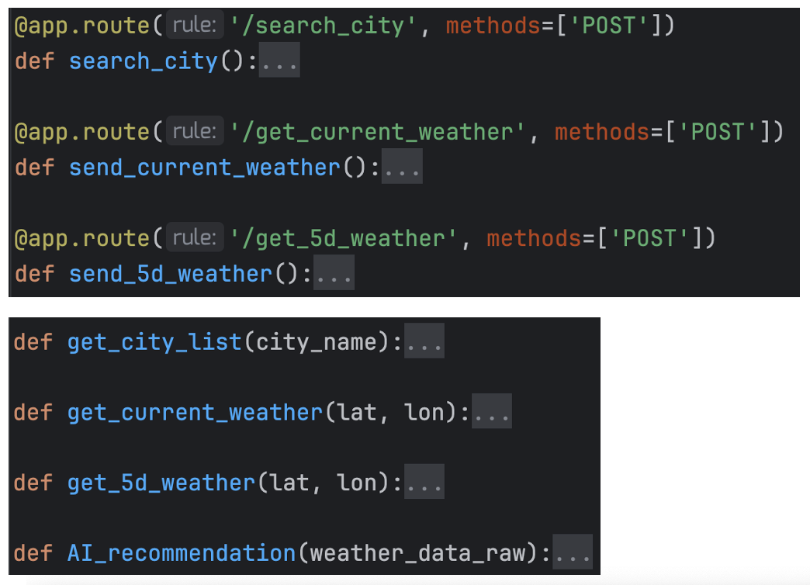

<div align="center">
    <h1>Simple Weather Backend</h1>
</div>  

## API we used  
OpenWeatherMap API, Free tier.  
Get current weather data and 5 days weather forecast (1 forecast for each 3 hours).  
Deepseek V3 API, previously purchased, no additional cost.  
Compatible with ChatGPT, but due to payment and other issues, we still use Deepseek V3.  

## Back-end  
Python + Flask Server were used to build the back-end.  
Flask server, a light weight framework, is convenient and easy to use.  
Functions are highly Modularized, and easy to expand or modify features.  
  

For flask server, there are three main application routes:  
- /search_city:  
    - Input: City name in string format.  
    {"city": "city name(str)"}  
    - Output: List of city names.  
    [{"city": "city name(str)"}{...}]  
- /get_current_weather  
    - Input: Latitude and Longitude in string format.  
    {"lat": "latitude(str)", "lon": "longitude(str)"}  
    - Output: Current weather data and AI recommendation in List format.  
    [{"city name(str)", "current weather data(str)", ...}, {"AI recommendation(str)"}]  
- /get_5d_weather  
    - Input: Latitude and Longitude in string format.  
    {"lat": "latitude(str)", "lon": "longitude(str)"}
    - Output: 5 days weather forecast data (1 forecast for each 3 hours).  
    [{"city name(str)", "weather data(str)", ..., "time"},{}, ...] 

Flask server will call 4 functions depends on demand:  
- get_city_list()
    This function will send city name to OpenWeatherMap to get a list of city names for user to choose.  
- get_current_weather()
    This function will first check whether the weather data is already cached in the database and whether they are expired. If data exists and not expired, it will return the cached data.
    Otherwise, it will call OpenWeatherMap API to get the current weather data and cache it in the database.
- get_5d_weather()
    The same as get_current_weather(), but for 5 days weather forecast data.
- get_AI_recommendation()
    This function will send the weather data (mainly the current weather data) to Deepseek V3 API to get AI recommendation.  

Database operations are also modularized. There are 2 main operations: Read and Update. 
- db_get_current_weather()
    This function will get current weather data from the database.
- db_get_5d_weather()
    The same as db_get_current_weather(), but for 5 days weather forecast data.
- db_add_current_weather()
    This function will update current weather data to the database after fetching from OpenWeatherMap API.
- db_add_5d_weather()
    The same as db_add_current_weather(), but for 5 days weather forecast data.

## Database  
MySQL  
Open source and Free  
Cross-platform (compatible with both x86 and ARM)  
Cache weather data to reduce API cost  

MySQL is the second SQL database I have tried. The first was oracle, which can not run on my ARM cpu, causing many issues. MySQL and oracle are similar in many ways, so I can easily adapt to it.  

In this project, two tables were used:
- current_weather
```sql
city_name char(50) primary key not null,
lat float,
lon float,
region char(50),
weather_main char(50),
weather_description char(50),
temp float,
temp_feels_like float,
pressure int,
humidity int,
visibility int,
wind_speed float,
wind_deg float,
sunrise bigint,
sunset bigint,
last_updated datetime
```
- 5d_forecast
```sql
city_name char(50) not null,
lat float,
lon float,
region char(50),
weather_main char(50),
weather_description char(50),
temp float,
temp_feels_like float,
pressure int,
humidity int,
visibility int,
wind_speed float,
wind_deg float,
forecast_time datetime,
last_updated datetime
```
The two tables are similar, but the 5d_forecast table has an additional column for forecast time. For database part, they are simple but effective.  

## Cloud server  
Currently our "cloud server" was hosted in my dormitory at PRAIA PARK. Free electricity and network are provided so there is no additional cost for us. **Please be aware, after the end of this term I will leave the dormitory, and the server would be shut down.** You can still pull our code from Gitee and run it on your own server.  

## Back-end to Front-end API document  
Check [api_formats_safe.md](./assets/api_formats_safe.md).

## Docker compose and deployment  
Docker compose is used to package the back-end and database. Which is easy to maintain, migrate and safe for use. After pulling our code, you need to fill your own API key into **OpenWeatherMapAPI.txt**, **GPTapi.txt** and **DSapi.txt**. Then, run the following command to start the back-end after download all requirements and dependencies.  
```bash
docker-compose up -d
```
Then, you can access the back-end API at http://localhost:5000.
Deployment tests were done on my Darwin-arm laptop, Debian "cloud server" and my Windows PC.  

To initialize the database, I have prepared init.sql file. This script will automatically run when creating the docker-compose, making database ready for use.  


## Conclusion
In conclusion, this weather app project aims to provide users with essential weather information in an intuitive and accessible way. We strive to ensure that users accurate information to their needs. The project will offer a valuable experience in software management and development. All in all, we look forward to completing the project and delivering a functional and reliable tool for users.  
